# Modelo Entidade-Relacionamento — Zovic

Documentação do modelo de dados, transcrita do diagrama `Zovic.drawio`.

> Os tipos das colunas no diagrama Mermaid foram inferidos pelo nome do campo (o diagrama original não especifica tipos). Ajuste conforme a implementação real.

## Diagrama

```mermaid
erDiagram
    plan_type ||--o{ plan : "classifica"
    plan ||--o{ plan_user : "possui"
    user ||--o{ plan_user : "assina"

    user ||--o{ user_event : "gera"
    user ||--o{ playlist_user : "participa"
    playlists ||--o{ playlist_user : "tem membros"
    user ||--o{ music_user : "salva"
    musics ||--o{ music_user : "salva por"

    user ||--o{ rating : "avalia"
    musics ||--o{ rating : "recebe"
    user ||--o{ comments : "escreve"
    musics ||--o{ comments : "recebe"
    musics ||--o| music_stats : "estatísticas"

    playlists ||--o{ music_playlist : "contém"
    musics ||--o{ music_playlist : "está em"

    musics ||--o{ lyrics_music : "tem"
    lyrics ||--o{ lyrics_music : "pertence"

    musics ||--o{ genre_music : "tem"
    genre ||--o{ genre_music : "classifica"
    genre ||--o{ album_genre : "classifica"
    album ||--o{ album_genre : "tem"

    musics ||--o{ album_music : "está em"
    album ||--o{ album_music : "contém"
    album ||--o{ album_artist : "de"
    artist ||--o{ album_artist : "lança"
    artist ||--o{ artist_music : "interpreta"
    musics ||--o{ artist_music : "de"

    plan_type {
        int id PK
        string name
        decimal price
        int user_amount
        datetime deleted_at
        datetime updated_at
        datetime created_at
    }
    plan {
        int id PK
        string name
        int type_id FK
        datetime deleted_at
        datetime updated_at
        datetime created_at
    }
    plan_user {
        int plan_id FK
        int user_id FK
        bool is_admin
    }
    user {
        int id PK
        string name
        date birthdate
        datetime deleted_at
        datetime updated_at
        datetime created_at
    }
    user_event {
        int id PK
        int user_id FK
        enum event_type
        datetime created_at
    }
    playlist_user {
        int playlist_id FK
        int user_id FK
        bool is_admin
    }
    music_user {
        int music_id FK
        int user_id FK
        datetime created_at
        datetime deleted_at
    }
    system_data {
        int users "tabela de linha única"
        int songs
        int playlists
        datetime updated_at
        datetime created_at
    }
    rating {
        int id PK
        int music_id FK
        int user_id FK
        int rating
        datetime deleted_at
        datetime updated_at
        datetime created_at
    }
    comments {
        int id PK
        int music_id FK
        int user_id FK
        string comment
        int timestamp "segundos"
        datetime deleted_at
        datetime updated_at
        datetime created_at
    }
    music_stats {
        int id PK
        int music_id FK
        string genre
        int duration
        int streams
        float rating
    }
    playlists {
        int id PK
        string name
        bool is_private
        string color
        datetime deleted_at
        datetime updated_at
        datetime created_at
    }
    music_playlist {
        int music_id FK
        int playlist_id FK
    }
    lyrics {
        int id PK
        datetime created_at
        datetime updated_at
        datetime deleted_at
    }
    lyrics_music {
        int lyrics_id FK
        int music_id FK
    }
    musics {
        int id PK
        string name
        int duration
        datetime created_at
        datetime updated_at
        datetime deleted_at
    }
    genre_music {
        int genre_id FK
        int music_id FK
    }
    genre {
        int id PK
        string name
        string color
        datetime created_at
        datetime updated_at
        datetime deleted_at
    }
    album_genre {
        int genre_id FK
        int album_id FK
    }
    album {
        int id PK
        string name
        datetime created_at
        datetime updated_at
        datetime deleted_at
    }
    album_music {
        int album_id FK
        int music_id FK
    }
    album_artist {
        int album_id FK
        int artist_id FK
    }
    artist {
        int id PK
        string name
        datetime created_at
        datetime updated_at
        datetime deleted_at
    }
    artist_music {
        int artist_id FK
        int music_id FK
    }
```

## Entidades

### Planos e usuários

| Tabela | Colunas | Relacionamentos |
|---|---|---|
| `plan_type` | `id`, `name`, `price`, `user_amount`, `deleted_at`, `updated_at`, `created_at` | 1:N com `plan` |
| `plan` | `id`, `name`, `type_id`, `deleted_at`, `updated_at`, `created_at` | `type_id` → `plan_type.id` |
| `plan_user` | `plan_id`, `user_id`, `is_admin` | Associativa `plan` ↔ `user` |
| `user` | `id`, `name`, `birthdate`, `deleted_at`, `updated_at`, `created_at` | — |
| `user_event` | `id`, `user_id`, `event_type` (ENUM), `created_at` | `user_id` → `user.id` |
| `system_data` | `users`, `songs`, `playlists`, `updated_at`, `created_at` | Tabela de linha única com contagens agregadas do sistema (sem `id` e sem FK) |

### Interações do usuário com músicas

| Tabela | Colunas | Relacionamentos |
|---|---|---|
| `music_user` | `music_id`, `user_id`, `created_at`, `deleted_at` | Associativa `musics` ↔ `user` |
| `rating` | `id`, `music_id`, `user_id`, `rating`, `deleted_at`, `updated_at`, `created_at` | `music_id` → `musics.id`, `user_id` → `user.id` |
| `comments` | `id`, `music_id`, `user_id`, `comment`, `timestamp` (segundos), `deleted_at`, `updated_at`, `created_at` | `music_id` → `musics.id`, `user_id` → `user.id` |
| `music_stats` | `id`, `music_id`, `genre`, `duration`, `streams`, `rating` | `music_id` → `musics.id` |

### Playlists

| Tabela | Colunas | Relacionamentos |
|---|---|---|
| `playlists` | `id`, `name`, `is_private`, `color`, `deleted_at`, `updated_at`, `created_at` | — |
| `playlist_user` | `playlist_id`, `user_id`, `is_admin` | Associativa `playlists` ↔ `user` |
| `music_playlist` | `music_id`, `playlist_id` | Associativa `musics` ↔ `playlists` |

### Catálogo musical

| Tabela | Colunas | Relacionamentos |
|---|---|---|
| `musics` | `id`, `name`, `duration`, `created_at`, `updated_at`, `deleted_at` | — |
| `lyrics` | `id`, `created_at`, `updated_at`, `deleted_at` | — |
| `lyrics_music` | `lyrics_id`, `music_id` | Associativa `lyrics` ↔ `musics` |
| `genre` | `id`, `name`, `color`, `created_at`, `updated_at`, `deleted_at` | — |
| `genre_music` | `genre_id`, `music_id` | Associativa `genre` ↔ `musics` |
| `album` | `id`, `name`, `created_at`, `updated_at`, `deleted_at` | — |
| `album_genre` | `genre_id`, `album_id` | Associativa `genre` ↔ `album` |
| `album_music` | `album_id`, `music_id` | Associativa `album` ↔ `musics` |
| `artist` | `id`, `name`, `created_at`, `updated_at`, `deleted_at` | — |
| `album_artist` | `album_id`, `artist_id` | Associativa `album` ↔ `artist` |
| `artist_music` | `artist_id`, `music_id` | Associativa `artist` ↔ `musics` |

## Convenções

- Tabelas com `deleted_at` usam *soft delete*.
- Tabelas associativas (N:N) não têm `id` próprio; a chave primária é composta pelas duas FKs.
- `created_at` / `updated_at` registram auditoria temporal.
- `system_data` é uma tabela de linha única: guarda os totais agregados do sistema (usuários, músicas e playlists) e é sempre atualizada no lugar, nunca recebe novas linhas. Por isso não tem `id` nem relacionamentos. Recomenda-se garantir a unicidade no próprio banco, por exemplo com uma constraint ou trigger que impeça um segundo `INSERT`.

## Pontos em aberto

- `lyrics` ainda não tem coluna de conteúdo: a forma de armazenar o texto das letras ainda não foi decidida.
